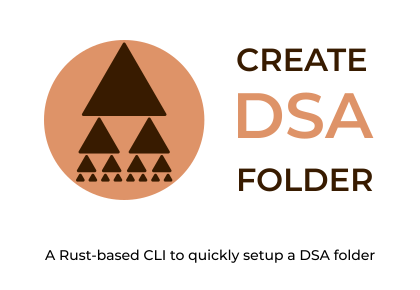

  <picture>
    
  </picture>

## Overview

The CLI was built specifically for my own "Data Structures and Algorithms in TypeScript" [repository](https://github.com/vladdoroniuk/data-structures-and-algorithms). Instead of manually creating a DSA folder with the corresponding files, the process can be speeded up using this CLI.
